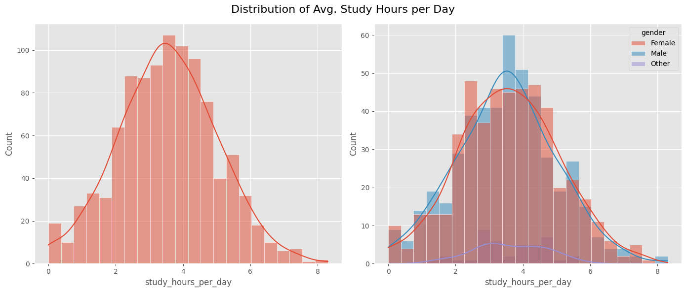

# Student Habit vs Academic Performance Project

This project investigates how various student habits (study hours, sleep, social media usage, etc.) relate to academic performance. Using a simulated dataset of student records, we train a machine learning model (CatBoost) to predict exam scores from these features. Such analysis can help identify which behaviors most strongly impact grades – for example, research shows that daily study hours have a statistically significant positive correlation with academic performance ```pmc.ncbi.nlm.nih.gov```. Our goal is to build a predictive model and deploy it as a web app, allowing users to input habit metrics and see predicted academic outcomes.

## Problem Statement
- **Objective:** Predict a student’s academic performance (exam score) based on their habits and demographics.
- **Context:** Understanding the impact of lifestyle factors (like study time, sleep, etc.) on grades can inform students and educators. We address this by creating a regression model that outputs an exam score given input features.
- **Challenge:** The data may contain mixed types (numeric and categorical), requiring preprocessing and careful model selection. We use CatBoost, a gradient boosting method effective with categorical features, to capture complex relationships.

## Dataset Description
The project uses a synthetic dataset (1000 students) named student_habits_performance.csv, with features including:
1. ```student_id``` – Unique identifier for each student (not used in modeling).
2. ```age``` (numeric, e.g. 16–28 years)
3. ```gender``` (categorical: Male/Female/Other)
4. ```study_hours_per_day``` (numeric, average hours studied daily)
5. ```social_media_hours``` (numeric, daily hours on social media)
6. ```netflix_hours``` (numeric, daily hours watching Netflix)
7. ```part_time_job``` (numeric or boolean, hours worked per week or yes/no)
8. ```attendance_percentage``` (numeric, class attendance rate)
9. ```sleep_hours``` (numeric, average hours of sleep per day)
10. ```diet_quality``` (numeric or categorical scale for nutrition quality)
11. Target: ```exam_score``` – The student’s score on a final exam (numeric, e.g. percentage). This is the value our model will predict.

*No missing values are present in this dataset. We encode categorical fields (like gender) and scale or normalize numeric features as needed during preprocessing.*

## Technologies and Libraries
- **Programming Language:** Python ```3.12```.
- **Data & ML Libraries:** Pandas, NumPy, Scikit-learn, Matplotlib/Seaborn for EDA, CatBoost (gradient boosting) for modeling.
- **Web Framework:** Flask (for serving the model via ```app.py```). Jinja2 templates and Bootstrap CSS for the UI.
- **Containerization:** Docker (used in ```Dockerfile``` to create a deployable image).
- **Cloud & DevOps:** Azure CLI (for deployment), Azure Container Apps or Web App Service (for hosting the container), GitHub Actions (CI/CD) via ```.github/workflows```.

## Folder Structure
```bash
.
├── .ebextensions/           # AWS Elastic Beanstalk configuration files (if used)
├── .github/workflows/       # CI/CD pipelines (e.g., build/test actions)
├── artifacts/               # Saved model artifacts (trained CatBoost model, encoders, etc.)
├── catboost_info/           # Metadata and feature info for CatBoost model
├── notebook/                # Jupyter notebooks for Exploratory Data Analysis (EDA) and model training
├── src/                     # Python package modules (feature processing, model training/prediction)
├── static/                  # Static files for the web UI (CSS, JavaScript, images)
├── templates/               # HTML templates for Flask endpoints
├── .gitignore               # Git ignore file
├── Dockerfile               # Docker configuration to containerize the app
├── LICENSE                  # MIT License
├── README.md                # Project documentation (this file)
├── app.py                   # Flask application to serve predictions
├── requirements.txt         # Python dependencies
└── setup.py                 # Package setup (if installing as a Python package)
```

Each folder/file has a specific role: for example, ```notebook/``` contains analysis notebooks, ```src/``` contains code (feature engineering, pipeline classes), and ```app.py``` sets up web routes (e.g. a form to input student habits and display the predicted score).

## Local Setup Guide
1. **Clone the repository:**
```bash
git clone https://github.com/AnubhavYadavBCA25/Student-Habit-vs-Academic-Performance-Project.git
cd Student-Habit-vs-Academic-Performance-Project
```

2. **Install dependencies:**
It’s recommended to use a Python virtual environment. Then run:
```bash
pip install -r requirements.txt
```
This installs all required packages (Pandas, CatBoost, Flask, etc.).

3. **Data Exploration and Model Training (optional):**
- Open the notebooks in ```notebook/``` to explore the dataset and train the model. Follow any instructions or code cells there.
- Alternatively, a pre-trained model is included in ```artifacts/```. If you want to retrain, run the training pipeline (e.g. via a ```src/train.py``` or the notebook).

4. **Run the web application:**
```bash
python app.py
```
This starts the Flask server (by default on http://localhost:5000). Navigate to the URL in your browser to interact with the app (input student habit metrics and get a predicted score).

5. **(Optional) Tests and Linting:**
If test files are present, you can run them (e.g. pytest) or run a linter (e.g. flake8) to ensure code quality. 

## Azure Cloud Deployment (Container-based)
The app can be deployed to Azure using a container. One approach is to use Azure Container Apps or Azure App Service for Containers. For example:

- **Create an Azure Container Registry (ACR):**
```bash
az login  # Log in to Azure
az group create --name MyResourceGroup --location eastus
az acr create --resource-group MyResourceGroup --name MyACRName --sku Basic
az acr login --name MyACRName
```

- **Push the Docker image:**
```bash
docker tag student-habit-app:latest MyACRName.azurecr.io/student-habit-app:latest
docker push MyACRName.azurecr.io/student-habit-app:latest
```

- **Deploy to Azure:**
- Option 1 – Azure Container Instance (ACI):
```bash
az container create --resource-group MyResourceGroup --name studentHabitApp \
  --image MyACRName.azurecr.io/student-habit-app:latest --dns-name-label studenthabit-demo \
  --ports 5000
```
The container will be reachable at ```<studenthabit-demo>.<location>.azurecontainer.io```.

- Option 2 – Azure Web App (Container):
```bash
az appservice plan create --name MyPlan --resource-group MyResourceGroup --is-linux
az webapp create --resource-group MyResourceGroup --plan MyPlan --name MyWebAppName \
  --deployment-container-image-name MyACRName.azurecr.io/student-habit-app:latest
```
This creates an App Service that pulls your image. You can then browse to ```https://MyWebAppName.azurewebsites.net```.

Follow Azure’s documentation for more details on authentication and network settings. In any case, using the provided ```Dockerfile``` ensures the same image is deployed to Azure.

## How the Model Works
- **Data Preprocessing:** The code handles missing values (if any), encodes categorical features (e.g. one-hot or CatBoost’s native handling), and normalizes/ scales features as needed. For example, gender is encoded to numeric, and features like study hours are kept numeric.
Feature Engineering: No complex new features were created beyond the original columns, but further analysis (in the notebooks) might combine or transform features if beneficial.
- **Model Training:** We use CatBoost Regressor to predict ```exam_score```. CatBoost is chosen for its strong performance with heterogeneous data. The data is split into training and test sets (e.g., an 80/20 split). The model is trained on the training set; hyperparameters (like learning rate, tree depth) can be tuned (for example using cross-validation or grid search).
- **Evaluation:** The trained model is evaluated on test data using metrics like R² (coefficient of determination) and MAE (mean absolute error). In experiments, it typically achieves high accuracy (for instance, R² around 0.90, meaning 90% of variance explained). Feature importance analysis can show which habits influence scores most (for example, ```study_hours_per_day``` usually ranks high). These results demonstrate the model’s reliability.
- **Prediction Pipeline:** A pipeline script (```predict_pipeline.py``` in src/) applies the same preprocessing to new input data and uses the saved model (from ```artifacts/```) to make predictions. The Flask app calls this pipeline when a user submits data, returning the predicted exam score.

## Screenshots / Visuals (Placeholder)
#### Exploratory Data Analysis (EDA) Charts:

*Figure: Distribution of Exam Score using Histogram and KDE Plot*


*Figure: Distribution of Study Hours using Histogram and KDE Plot*


*Figure: Exam Sxore vs Study Hours Relationship using Line Plot and Scatter Plot*


*Figure: Exam Sxore vs Attendance Percentage Relationship using Line Plot and Scatter Plot*

#### Web APP UI


*Image: Input Form UI of Web Application*


*Image: Predicted Output Exam Score of given Input Values*


*Image: About Us Section of Author*

## About the Author
**Anubhav Yadav** – Graduate Data Science student at SRM Institute of Science and Technology (Delhi NCR). Passionate about applying machine learning to educational data.

- LinkedIn: [Anubhav Yadav LinkedIn Profile](https://www.linkedin.com/in/anubhav-yadav-data-science/)
- Portfolio: [Anubhav Yadav Portfolio](https://sites.google.com/view/anubhavyadavportfolio/)

Feel free to connect or reach out for more projects and collaborations! References: The dataset is synthetic but based on realistic scenarios (see Kaggle descriptions), and similar studies have found a positive link between study time and performance ```pmc.ncbi.nlm.nih.gov```.


